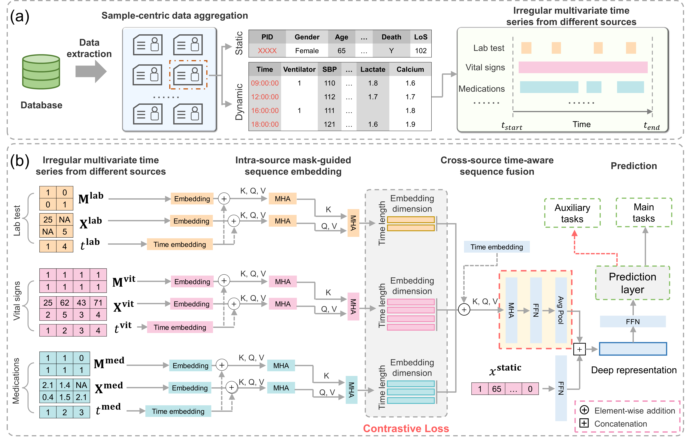

# Time-aware attention-based deep representation learning for multi-source longitudinal data with structured missingness in electronic medical records

This repository hosts the implementation of our novel framework designed to address structured missingness in multi-source longitudinal electronic medical records (EMR). Traditional methods often fail to fully capture the complexities inherent in EMR data, such as multi-sourced inputs and irregular longitudinal intervals, resulting in significant information loss. Our approach leverages a time-aware attention-based deep representation learning model to overcome these challenges.

### Overview

Our method uniquely handles the temporal attributes of data sources, employing a mask-guided selfattention embedding module to recognize missing patterns and capture longitudinal dependencies within each source. To integrate data from various sources effectively, we designed a time-aware crosssource attention module that aligns embedding sequences chronologically, learning global correlations and time dependencies.

The framework is enhanced with a contrastive loss method that reduces the relative distance between embeddings from different sources, facilitating the fusion of diverse data modalities. Auxiliary tasks leverage missing masks to reconstruct original sequences, aiding in the learning of effective representations between different sources.

### Key Features
- Mask-Guided Self-Attention Embedding: Captures missing patterns and longitudinal dependencies within each data source.
- Time-Aware Cross-Source Attention Module: Aligns and fuses data from various sources based on chronological order and time dependencies.
- Contrastive Loss Method: Minimizes the distance between different source embeddings, promoting effective data fusion.
- Auxiliary Reconstruction Tasks: Utilizes missing masks for original sequence reconstruction, enhancing fusion representations between sources.

